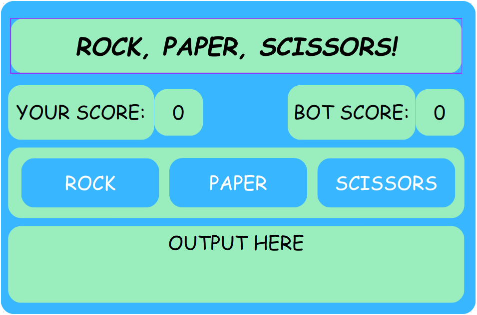

## Rock, Paper, Scissors
A simple game of rock, paper, scissors!

## Planning
> [!NOTE]
> This was carried out as a way to practice planning skills neccessary in any project on this simpler one.

### [1] Layout:
> [!NOTE]
> Example design to show main components.



### [2] Idea:
- Game runs until one of the players reaches 5 points.
- User can choose between the choices on the screen.
- Based on rules, winner of the round is determined.
- Scores updated.
- Round messages are displayed.

### [3] Pseudocode:

### General
```
01 Display initial scores
02 Detect human choice
02 Generate computer choice
04 Compare choices and determine winner based on:
..    'rock' beats 'scissors'
..    'paper' beats 'rock'
..    'scissors' beats 'paper'
05 Update scores
06 Display results
07 Repeat 02 until one of scores is equal to 5
08 Display winner
09 End game      
```

### For Step [03]
```
01 Pick a random number from 1 to 3
02 Match number to choice
.. 1 is 'rock'
.. 2 is 'paper'
.. 3 is 'scissors'
03 Return choice
```